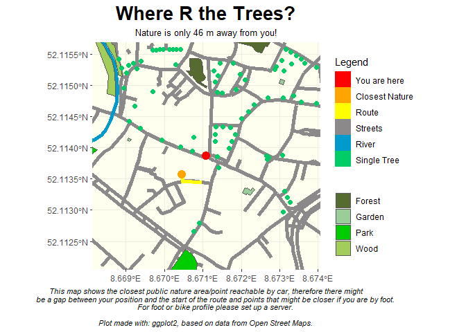

# whereRthetrees

Being outside in nature is proven to be good for body and mind. It can
be calming, relaxing and grounding. It can make one happy and more
level-headed. So take a break, look for the closest public nature spot
and go for a walk!

## Installation

You can install the development version of whereRthetrees from
[GitHub](https://github.com/) with:

``` r
# install.packages("devtools")
devtools::install_github("sonjamaas/whereRthetrees")
```

## Example

This is a basic example which shows you how to use this package:

``` r
library(whereRthetrees)
whereRthetrees(8.671087, 52.113866, 200)
#> [1] "No forest specified as broad- or needleleafed in this area"
#> [1] "No grassland in this area"
#> [1] "No nature reserve in this area"
#> [1] "No meadow in this area"
#> [1] "No tree lines in this area"
```



Take a break from work and go hug a tree!
